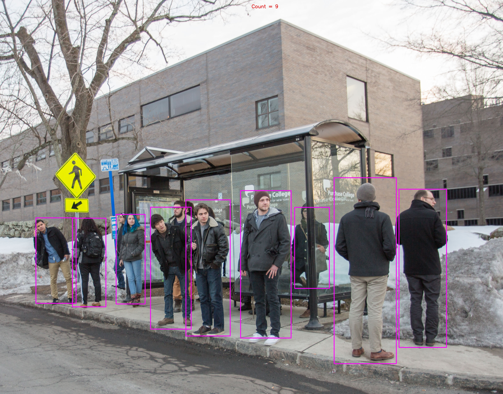

#PyTorch implementation of YOLOv3 obejct detector

This is an implementation of YOLOv3 object detector using PyTorch. This code dependes on the darknet
implementation of YOLOv3. The official darknet website can be found [here](https://pjreddie.com/darknet/yolo/).

##Instalation

###Install requirements
```
$ git clone https://github.com/eriklindernoren/PyTorch-YOLOv3
$ cd PyTorch-YOLOv3/
$ sudo pip install -r requirements.txt
```
Download model weights [here](https://pjreddie.com/media/files/yolov3.weights) and add it to weights folder  

##Detection Example


##Video processing
processing.py file is to be used for video processing. It contains `processing()` method which is resposible for **inference**.
I have used YOLOv3 for person detection and counting. Follow this [link](https://www.youtube.com/watch?v=Q32LtQBxNM4&feature=youtu.be&fbclid=IwAR0JcQ4nSZO9pk2ZQ40b0MRuJPgtY1lVb2fK5IbbC9npPsoIsYceP-tBExo) to watch the output video.
